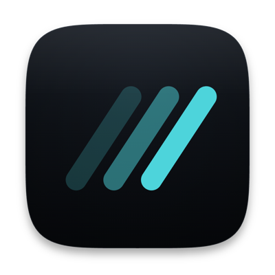

<p align="center">
  
</p>

# Tarmac

**A terminal-first cockpit for working alongside CLI coding agents.**


https://github.com/user-attachments/assets/0cf7d574-c86b-4f36-897d-c4dad23cf585

You run `claude` (or any agent) in a real terminal inside Tarmac. When that
agent — or you, or a Makefile, a git hook, CI — runs `tarmac open <path>`, the
referenced markdown doc appears as a card on an infinite, pannable, zoomable
**board**, placed right next to the terminal that called it and tied to it by a
dashed provenance edge. The terminal stays the center of gravity; the docs your
tools produce gather around it.

Tarmac is deliberately **not an agent harness**. It never sits between you and
the tool, never parses the agent's output to guess what it's doing, and never
claims "the agent is working / waiting." Every mark on screen is backed by
something the operating system can actually observe — a running process, a
file's mtime changing, a `tarmac open` socket call, a terminal bell. The
workspace grows out of facts, not configuration: there is no welcome screen, no
import step, no setup. Surfaces appear the moment a real event produces them.

> Status: **working prototype.** Milestones M0–M3 and the v4 whiteboard
> migration are complete on `main`. The UI is a native Swift/AppKit app whose
> terminal cards are built on libghostty-vt. See [Status](#status).

---

## The idea

- **The terminal is the body; docs are summons.** Tarmac is "a terminal that
  grows docs," not "a doc app with a terminal attached." It opens as a bare
  shell; everything else materializes from what actually runs.

- **An infinite board of free cards.** A *board* is an infinite canvas you pan
  and zoom. The terminal and every opened doc are free cards carrying a
  world-space position — **position is memory**, persisted per board, restored
  exactly on relaunch. There is no grid, no slot cap.

- **`tarmac open` is a universal doorbell.** Any caller can ring it — the agent,
  you, a Makefile, a hook, CI. A doc card's fresh mark *means* "someone ran
  `tarmac open`," full stop. That universality is why the integration is a plain
  CLI over a Unix socket and not MCP, which would re-couple Tarmac to one agent
  runtime.

- **Honest signals, never a harness.** Four marks, each one observable fact: a
  terminal card's label is its foreground process name (the process table), a
  teal ring and `✚ now` on a doc card (`tarmac open` was called), `✎ 5s` in its
  header (the file changed on disk), an amber dot (the terminal rang its bell).
  Copy is temporal, never causal. Tarmac reports; it does not arbitrate.

- **The terminal keeps focus.** Typing goes to the terminal you last put it in.
  An agent firing an event — a doc opening, a file changing, a bell — only marks
  the board; it never switches your view or takes your keystrokes.

## What it feels like

```
  board: api                                       [ attached ]
  -------------------------------------------------------------

   +- claude -----------+         +- plan.md ---------+
   | $ claude           |   open  | # Migration plan  |
   | > writing plan...  | ------> | ## Phase 1 ...    |
   | * opened plan.md   |  edge   | * edited 5s ago   |
   +--------------------+         +-------------------+

   [-] 100% [+]   fit                          ( minimap )
```

Run an agent. It writes a plan and calls `tarmac open plan.md`. The doc lands
beside it with a provenance edge. The agent edits the file; the card re-renders
and its header shows `✎ 5s`.
You drag the terminal somewhere quieter and the plan follows it (gravity). You
press `⌘T` for a second shell and `⌘K` to flip to another board, all without
leaving the keyboard.

## Status

Built and shipped on `main`:

- **Infinite board** with a choice of four pairs of themes (Breeze, Catppuccin, GitHub, Solarized),
  each light and dark, and the Ghostty theme files you put in `~/.config/tarmac/themes/`,
  world-space card frames, pan/zoom, and
  per-board persisted layout + viewport.
- **`tarmac open` → cards** with gravity (docs follow their terminal) and dashed
  **provenance edges**.
- **Honest signals**: foreground process name, file-change pulse, terminal bell,
  exit codes — each from a real OS fact.
- **Wayfinding**: minimap, zoom control, and offscreen signal pills.
- **Terminal primacy**: a prime card, multiple terminal cards (`⌘T`), `⌥`-tab
  cycling, dead cards on exit (no auto-respawn).
- **Multiple boards**: a `⌘K` switcher with live per-board running / bell / card
  counts, `⌘1`–`9` jump to the filtered rows, create (`⌘N`) / rename (`⌘E`) /
  delete (`⌘⌫`, refuses the last board).
- **HTML cards**: a `.html` doc runs as a sandboxed, zoom-stable card with its
  own console badge; look-don't-touch until a double-click borrows it.
- **Session liveness**: an honest `attached` / reason readout in the status bar,
  bounded auto-reconnect, and surviving shells kept in place — history restored
  from the daemon's scrollback ring, no respawn — when the app reconnects to a
  still-running daemon.

Not built yet — see [`docs/backlog.md`](docs/backlog.md) for the full audit:
the `tarmac focus` verb + idle-switch banner, the session-restore overlay,
in-terminal doc-path linkification, the status-bar process chip, the doc-rewrite
"place kept" pill, and edge-split drop. **Editable docs (v4c)** is a captured
*proposal*, not scheduled work — nothing of it exists in the code. Real
tmux/bare-attach, auto board-naming, and daemon-restart PTY re-parenting are
deferred by decision; the shelf, the terminal dock pane, and peek (`⌘P`) were
deliberately dropped.

## Architecture at a glance

Two processes over one Unix socket, length-prefixed MessagePack:

```
   +--------------------------+       +------------------------------+
   |TarmacApp (Swift / AppKit)|       |tarmacd (Rust/Tokio)          |
   |the cockpit glass         | <---> |the observatory + PTY owner   |
   | - boards / cards         | unix  | - boards, docs, terminals    |
   | - terminal cards         |socket | - fswatch, process polling   |
   |   (libghostty-vt)        |msgpack| - persistence (state.json)   |
   | - doc cards (marked)     |frames |                              |
   +--------------------------+       +------------------------------+
                                                  |
                                                  |  spawns ptys
                                                  v  (sets TARMAC_TERM_ID)
   $ tarmac open <path>   --------------->  tarmac CLI (Rust)
   (run inside a tarmac pty)                rings the doorbell over the socket
```

The daemon owns everything durable or observed (boards, docs, PTYs, file
events, persistence). The app renders facts and takes human input. They share
nothing in-process — only the wire protocol, which grows by **additive keys
only** so old and new clients always interoperate.

Full design: **[`docs/architecture.md`](docs/architecture.md)**. Wire contract:
**[`docs/protocol.md`](docs/protocol.md)**.

## Build & run

Requires macOS 26+, a Rust toolchain with edition 2024, and a Swift 6.2+
toolchain (Xcode). Node.js is needed only for the repo's own checks
(`make docs-check`, `make dco-check`) and the QA scripts. Everything goes
through the `Makefile`:

```sh
make core    # cargo build the daemon, CLI, and protocol crate
make app     # stage the pinned libghostty-vt, then swift build the native app
make test    # docs-check + cargo test (core) + swift test (app)
make run     # build and launch the dev app against this worktree's own daemon
```

The first `make app` downloads the pinned libghostty-vt XCFramework into the
gitignored `app/Vendor/`. `make run` pins the daemon socket, the state and the
config directory to this worktree's `.dev/` (so a dev build never touches an
installed Tarmac), sets
`TARMAC_DAEMON` (so the app auto-spawns the freshly built daemon) and prefixes
`PATH` with the debug build dir (so `tarmac open` inside the app's own terminals
resolves the freshly built CLI). The CLI itself is just:

```sh
tarmac open <path>     # surface a markdown file as a card on the active board
tarmac --version       # report the cli, daemon, and app versions
tarmac skill           # print the agent-facing guide to writing Tarmac cards
tarmac skill install   # install a SKILL.md that points coding agents at that guide
```

`open` and `--version` are the two verbs that talk to the daemon. Inside a Tarmac
terminal `open` auto-attributes the doc to the calling terminal card via
`TARMAC_TERM_ID`. `--version` only completes the handshake, then prints the three
versions that drift independently after an upgrade — this CLI, the running
daemon, and the app connected to it — plus the channel and socket it resolved; it
exits 0 whether or not a daemon is running.
`tarmac skill` never opens the socket: it emits
[`core/crates/tarmac-cli/src/GUIDE.md`](core/crates/tarmac-cli/src/GUIDE.md), which tells an
agent how to surface files and how to author HTML cards that satisfy the board's
sandbox and zoom model. `tarmac skill install` copies a short shim,
[`core/crates/tarmac-cli/src/SKILL.md`](core/crates/tarmac-cli/src/SKILL.md), into Claude
Code (`~/.claude/skills`) and Codex (`~/.agents/skills`). The shim holds no
rule: it tells the agent to run `tarmac skill`, so the guide an agent reads is
always the one of the installed CLI.

## Repo layout

| Path | What it is |
| --- | --- |
| `core/` | Rust cargo workspace (edition 2024): `tarmac-protocol` (wire types + codec + conformance vectors), `tarmacd` (the daemon), `tarmac-cli` (the `tarmac` CLI). |
| `app/` | SwiftPM package (Swift 6, macOS 26+): `TarmacKit` (the Swift wire codec, the daemon client and every pure decision — where the tests are), `TarmacTerm` (the terminal card, on libghostty-vt), `TarmacApp` (the AppKit shell). |
| `docs/` | Engineering docs — see the [docs map](#docs) below. |
| `scripts/` | `fetch-ghostty-vt.sh` (stage the pinned XCFramework), `bundle.sh` (unsigned `.app`), `dmg.sh` (sign + notarized `.dmg`), `release.sh` (the whole release: `dmg.sh`, then the bump PR, the GitHub release and the Homebrew tap), `docs-check.mjs`, and the QA driver's scenario suites in `scripts/qa/`. |
| `qa/` | Hand-run QA records and the probe pages they use. Those dated before 2026-10 were run against the Tauri app. |
| `packaging/` | The bundle's `Info.plist`, icon, and the Homebrew cask. |
| `Makefile` | The build / test / run entrypoint. |

## Tests

Two suites, both run by `make test`: **Rust** in `core/` (protocol roundtrip +
frozen conformance vectors, daemon-lib, daemon integration over real sockets,
CLI), and **XCTest** in `app/` — `TarmacKitTests` over the app's pure logic and
its codec, `TarmacTermTests` over the terminal card. The AppKit shell
(`TarmacApp`) is not unit-tested by design — a decision is extracted into
`TarmacKit` and tested there; the UI is verified through the QA driver
(`make qa`, against a live `make run` app) and by hand. The wire contract has
two codecs, `tarmac-protocol` in Rust and `TarmacKit`'s in Swift; the same
conformance vectors are mandatory tests in both, and the Swift encoder is
pinned byte-for-byte to the Rust one's output.

## Docs

**Start at [`docs/README.md`](docs/README.md)** — the index. Every doc carries a
status banner under its title, because the doc set spans three UIs and five
closed milestones and a page's path does not tell you whether it is current:

- **ACTIVE** — describes `main` today; safe to cite as behaviour.
  [`docs/architecture.md`](docs/architecture.md) (engineering overview),
  [`docs/protocol.md`](docs/protocol.md) (wire contract + frozen conformance
  vectors), [`docs/backlog.md`](docs/backlog.md) (the audited unbuilt list),
  [`docs/workflow.md`](docs/workflow.md) (issue → PR conventions),
  [`docs/coding-style.md`](docs/coding-style.md) (coding style + mandatory TDD).
- **PROPOSED** — designed, zero lines implemented.
  [`docs/proposed/`](docs/proposed) — currently just the editable-docs (v4c)
  crib.
- **HISTORICAL** — frozen records of two earlier apps that no longer exist: the
  first Swift/AppKit app and the Tauri app that replaced it.
  [`docs/archive/`](docs/archive) (closed milestone plans + visual cribs) and
  [`docs/designs/`](docs/designs) (one record per shipped change).

`M0`–`M3` and `v4` are closed milestone names; `v4c` is an unstarted proposal.
There is no `M4`. Work since M3 is tracked per GitHub issue.

The original v3 design handoff (README + mocks + design-chat transcripts) is
preserved in git history; the surfaces it described (dock/index rails, grid desk,
tabs/splits) were intentionally replaced by the v4 whiteboard and are recorded as
such in [`docs/backlog.md`](docs/backlog.md).

## License

Tarmac is licensed under the [Apache License 2.0](LICENSE). Contributions are
welcome under the project's [contribution guidelines](CONTRIBUTING.md), which
require a Developer Certificate of Origin (DCO) sign-off.

The app is distributed with third-party scripts and libraries, each
under its own licence: [`NOTICE`](NOTICE) lists them and
[`THIRD-PARTY-LICENSES`](THIRD-PARTY-LICENSES) holds the licence texts. Both
ship inside `Tarmac.app`, in `Contents/Resources`.
